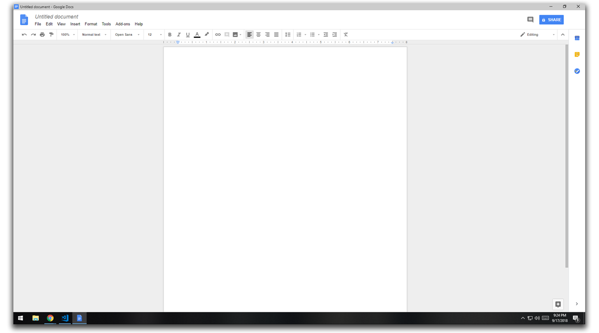

## Google Docs Popout
Browser extension for Google Chrome to automatically popout any opened Google Doc as popup window. Simulates a Microsoft Word experiece keeping document open in dedicated window.
* Easy to use
* Quick creation of new document
* Improves productivity by preventing tab loss

### Install on Chrome
1. Download googleDocsOut-master.zip [Download](https://github.com/adamwarniment/googleDocsOut/archive/master.zip)
2. Extract googleDocsOut-master to safe, installation location
3. Navigate to chrome://extensions
4. Enable Developer Mode
5. Select Load Unpacked and browse to installation location of googleDocsOut-master
